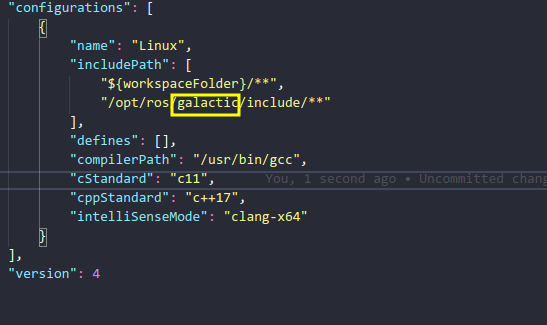
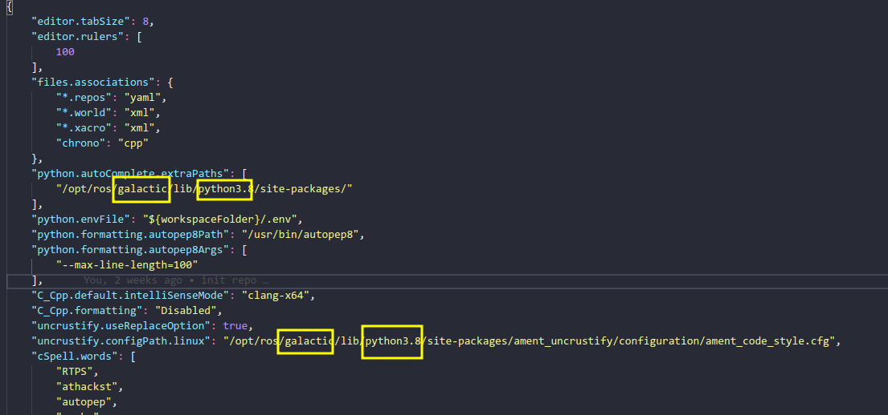
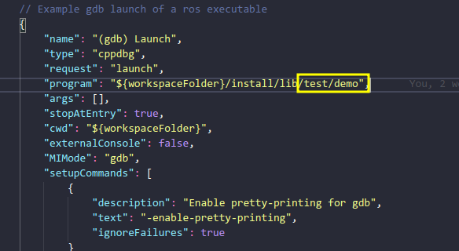
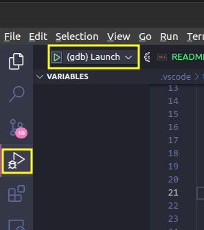

VS Code ROS2开发模板，解决头文件引用问题，搭建debug调试环境。

支持clangd 以及 ccls

# 使用

## 克隆此项目

```shell
git clone git@github.com:skywalker-dell/vscode_ros2_template.git
```

## 配置环境路径

- **在`c_cpp_properties.json` 中修改ROS2版本**

  

- **在`settings.json` 中修改ROS2版本和Python版本**

  保证每处地方都被修改到

  

- `ctrl+shift+B` 先编译默认名为`test` 的package。之所以这样做的原因是有时候单纯配置ROS2的环境变量无法解决头文件找不到的问题，必须在编译的时候加上`-DCMAKE_EXPORT_COMPILE_COMMANDS=1` 这个选项之后才能解决。

- 之后就可以愉快的码代码而不用担心找不到定义的问题

- 若还是不行，将在build目录下的`compile_commands.json` 文件移动至项目的根目录下

##  调试项目

- 选择你要调试的package ，编译命令如下

  ```shell
  colcon build --packages-select <package_name> --cmake-args -DCMAKE_BUILD_TYPE=Debug
  ```

- 在`launch.json` 中指定要调试这个package下的哪个`executable` 

   

- 打断点，愉快debug

  
